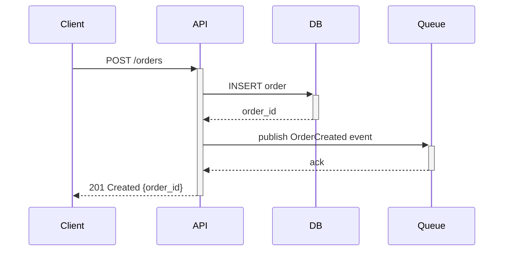
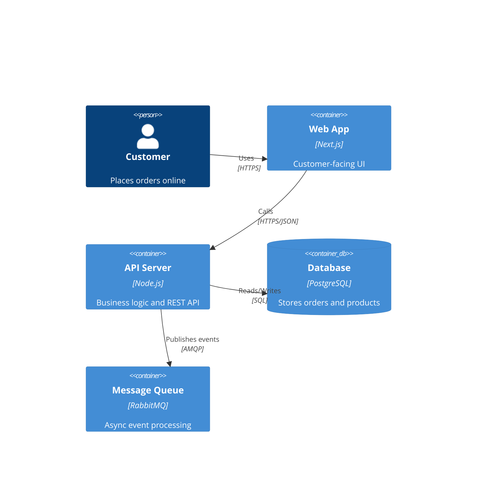

# Technical Documentation — API Docs, Architecture Documentation, Runbooks & Knowledge Management

## Vue d'ensemble / Overview

**FR** — Ce document de reference couvre l'ensemble des pratiques de documentation technique moderne : documentation d'API (OpenAPI, AsyncAPI), documentation d'architecture (modele C4, arc42, Structurizr), Architecture Decision Records (ADR), runbooks et playbooks operationnels, standards de README, maintenance de bases de connaissances, et outils de diagrammes (Mermaid, PlantUML, D2). La documentation technique n'est pas un livrable secondaire — c'est un multiplicateur de productivite. Une documentation a jour et accessible reduit le temps d'onboarding de 40%, diminue les interruptions entre developpeurs de 50%, et accelere la resolution d'incidents de 60%. Ce guide integre les meilleures pratiques 2024-2026, incluant la documentation generee par l'IA, les docs-as-code, et les frameworks de structuration comme Diataxis.

**EN** — This reference document covers the full spectrum of modern technical documentation practices: API documentation (OpenAPI, AsyncAPI), architecture documentation (C4 model, arc42, Structurizr), Architecture Decision Records (ADR), operational runbooks and playbooks, README standards, knowledge base maintenance, and diagramming tools (Mermaid, PlantUML, D2). Technical documentation is not a secondary deliverable — it is a productivity multiplier. Up-to-date and accessible documentation reduces onboarding time by 40%, cuts developer-to-developer interruptions by 50%, and accelerates incident resolution by 60%. This guide incorporates 2024-2026 best practices, including AI-generated documentation, docs-as-code, and structuring frameworks like Diataxis.

---

## API Documentation

### OpenAPI (Swagger) for REST APIs

OpenAPI is the industry standard for documenting REST APIs. Use a contract-first approach: write the OpenAPI specification before writing code.

**Contract-first workflow:**
1. Write the OpenAPI 3.1 specification in YAML. Define paths, request/response schemas, authentication, and error formats.
2. Review the spec in a PR. Use spectral (Stoplight) for linting and validation.
3. Generate server stubs from the spec (openapi-generator, oapi-codegen for Go, openapi-typescript for TypeScript).
4. Generate client SDKs automatically for consumers.
5. Publish interactive documentation (Redoc, Swagger UI, Scalar, or Mintlify).
6. Validate the implementation against the spec in CI using contract testing.

**OpenAPI best practices:**
- Use `$ref` to reference shared schema components (`components/schemas/`). Avoid inline schema definitions.
- Define meaningful `operationId` values — these become function names in generated SDKs.
- Document all error responses (400, 401, 403, 404, 409, 422, 500) with example payloads.
- Use `tags` to group endpoints by domain (Users, Orders, Payments).
- Include `description` fields at every level (path, operation, parameter, schema property). These become documentation text.
- Version APIs using URL path versioning (`/v1/`, `/v2/`) or header versioning. Document the versioning strategy.
- Use `examples` or `example` to provide realistic sample data for each schema.

**OpenAPI 3.1 key features:**
- Full JSON Schema compatibility (draft 2020-12)
- `webhooks` top-level field for documenting outgoing webhooks
- Support for `null` type alongside other types
- `pathItems` can be referenced, enabling reusable path patterns

**FR** — Utiliser OpenAPI 3.1 avec une approche contract-first : ecrire la specification avant le code, linter avec spectral, generer les stubs serveur et les SDKs client automatiquement, publier la documentation interactive avec Redoc ou Scalar, et valider l'implementation en CI.

### AsyncAPI for Event-Driven Architectures

AsyncAPI is the equivalent of OpenAPI for event-driven systems (Kafka, RabbitMQ, MQTT, WebSocket, AMQP, NATS).

**When to use AsyncAPI:**
- Documenting Kafka topics and message schemas
- Documenting WebSocket APIs
- Documenting message queue producers and consumers
- Any system where components communicate via asynchronous messages

**AsyncAPI specification structure:**
```yaml
asyncapi: 3.0.0
info:
  title: Order Events API
  version: 1.0.0
channels:
  orderCreated:
    address: orders.created
    messages:
      orderCreatedMessage:
        payload:
          type: object
          properties:
            orderId:
              type: string
              format: uuid
            customerId:
              type: string
            totalAmount:
              type: number
            createdAt:
              type: string
              format: date-time
operations:
  publishOrderCreated:
    action: send
    channel:
      $ref: '#/channels/orderCreated'
```

**Best practices:**
- Define message schemas using JSON Schema (shared with OpenAPI where possible).
- Document both producers and consumers for each channel.
- Include message examples with realistic data.
- Document retry policies, dead letter queues, and ordering guarantees.
- Use AsyncAPI Studio for visual editing and validation.
- Generate documentation with AsyncAPI Generator.

**FR** — AsyncAPI est l'equivalent d'OpenAPI pour les systemes event-driven (Kafka, RabbitMQ, WebSocket). Documenter les schemas de messages, les producteurs et consommateurs de chaque canal, les politiques de retry et les garanties d'ordonnancement.

---

## Architecture Documentation

### The C4 Model

The C4 model (Simon Brown) provides a hierarchical approach to architecture documentation at four zoom levels. It is the most widely adopted architecture diagramming standard in 2024-2026.

**Level 1 — System Context Diagram**
- Shows the system as a single box in the center, surrounded by the users (personas) and external systems it interacts with.
- Purpose: answer "what does this system do and who uses it?"
- Audience: everyone (technical and non-technical stakeholders).
- Create one per system. Update when new external integrations or user types are added.

**Level 2 — Container Diagram**
- Zooms into the system to show the high-level technical building blocks (containers): web application, API server, database, message queue, external service adapters.
- Purpose: answer "what are the major technical components and how do they communicate?"
- Audience: developers, architects, DevOps engineers.
- Create one per system. Update when containers are added, removed, or fundamentally restructured.

**Level 3 — Component Diagram**
- Zooms into a single container to show its internal components (modules, services, controllers, repositories).
- Purpose: answer "how is this container organized internally?"
- Audience: developers working on or integrating with this container.
- Create selectively — only for containers complex enough to warrant it. Do not create for simple CRUD services.

**Level 4 — Code Diagram**
- Zooms into a component to show code-level structure (classes, interfaces, relationships).
- Purpose: detailed design documentation.
- Audience: developers working directly on this component.
- Almost never manually created — generate from code using IDE tools or static analysis. Do not maintain manually; it will always be stale.

**FR** — Le modele C4 fournit quatre niveaux de zoom pour la documentation d'architecture : Contexte systeme (quoi et qui), Conteneurs (blocs techniques majeurs), Composants (organisation interne), Code (structure au niveau du code). Creer systematiquement les niveaux 1 et 2. Le niveau 3 selectivement. Le niveau 4 presque jamais manuellement.

### Structurizr for C4 Diagrams

Structurizr is the reference tool for creating C4 diagrams as code. Use Structurizr DSL to define architecture models in version-controlled text files.

**Example Structurizr DSL:**
```
workspace {
    model {
        user = person "Customer" "A customer of the online store"
        softwareSystem = softwareSystem "Online Store" {
            webapp = container "Web Application" "Next.js frontend" "TypeScript"
            api = container "API Server" "REST API" "Node.js/Express"
            db = container "Database" "Stores orders and products" "PostgreSQL"
            cache = container "Cache" "Session and product cache" "Redis"
            queue = container "Message Queue" "Order processing events" "RabbitMQ"
        }
        user -> webapp "Browses products, places orders"
        webapp -> api "Makes API calls" "HTTPS/JSON"
        api -> db "Reads/writes data" "SQL"
        api -> cache "Caches frequently accessed data"
        api -> queue "Publishes order events" "AMQP"
    }
    views {
        systemContext softwareSystem {
            include *
            autolayout lr
        }
        container softwareSystem {
            include *
            autolayout lr
        }
    }
}
```

**Best practices:**
- Store the `.dsl` file in the repository root or in a `docs/architecture/` directory.
- Render diagrams in CI and publish to the developer portal (Backstage TechDocs or documentation site).
- Use Structurizr Lite (free, self-hosted) or Structurizr Cloud for rendering.
- Complement with Mermaid diagrams for simpler ad-hoc visualizations.

### arc42 Architecture Documentation Template

arc42 is a comprehensive architecture documentation template widely used in European enterprises and regulated industries.

**arc42 sections:**
1. **Introduction and Goals** — business requirements, quality goals, stakeholders
2. **Constraints** — technical, organizational, and regulatory constraints
3. **Context and Scope** — system context (similar to C4 Level 1)
4. **Solution Strategy** — fundamental technology decisions and system decomposition approach
5. **Building Block View** — hierarchical decomposition (similar to C4 Levels 2-3)
6. **Runtime View** — key runtime scenarios and interaction sequences
7. **Deployment View** — infrastructure, environments, and deployment topology
8. **Crosscutting Concepts** — patterns applied across the system (security, error handling, logging)
9. **Architecture Decisions** — key decisions with rationale (can link to ADRs)
10. **Quality Requirements** — quality tree and test scenarios
11. **Risks and Technical Debt** — identified risks and known technical debt
12. **Glossary** — domain terminology

**When to use arc42**: large systems, regulated industries (healthcare, finance, government), projects requiring formal architecture documentation for audits or compliance.

**FR** — arc42 est un template de documentation d'architecture complet utilise dans les entreprises europeennes et les industries reglementees. Il couvre 12 sections de l'introduction aux risques. L'utiliser pour les grands systemes et les industries reglementees.

---

## Architecture Decision Records (ADR)

### What is an ADR

An ADR documents a single architectural decision along with its context, rationale, and consequences. ADRs create a decision log that explains "why" the architecture looks the way it does.

### ADR Template (MADR format)

Use the Markdown Architectural Decision Records (MADR) format:

```markdown
# ADR-0042: Use PostgreSQL for primary data storage

## Status
Accepted

## Date
2025-01-15

## Context
We need a primary database for the order management service. The service handles
~10,000 orders per day with complex queries joining orders, products, and customers.
We need ACID transactions, strong consistency, and rich querying capabilities.

## Decision
Use PostgreSQL 16 as the primary database for the order management service.

## Alternatives Considered

### MySQL 8
- Pros: wide adoption, good performance for simple queries
- Cons: weaker JSON support, less capable query planner for complex joins

### MongoDB
- Pros: flexible schema, easy horizontal scaling
- Cons: no ACID transactions across collections (until v4+), eventual consistency model
  not suitable for financial data

### CockroachDB
- Pros: distributed PostgreSQL-compatible, strong consistency
- Cons: operational complexity, cost, team lacks experience

## Consequences
- Team must maintain PostgreSQL expertise (training planned for Q2)
- Use connection pooling (PgBouncer) for high concurrency
- Plan for read replicas when read load exceeds single-node capacity
- Backup strategy: daily full backups + continuous WAL archiving

## References
- [PostgreSQL 16 release notes](https://www.postgresql.org/docs/16/release-16.html)
- [ADR-0038: Microservice architecture for order management](./0038-microservice-architecture.md)
```

### ADR Management Best Practices

1. **Store ADRs in the repository**: `docs/adr/` or `docs/decisions/` directory. One file per decision.
2. **Number sequentially**: `0001-use-react-for-frontend.md`, `0002-use-graphql-api.md`. Never renumber.
3. **ADRs are immutable once accepted**: do not edit past ADRs. If a decision is superseded, create a new ADR that references and supersedes the old one. Update the old ADR's status to "Superseded by ADR-XXXX."
4. **Review ADRs in PRs**: treat ADR creation as part of the code review process. Require at least one senior engineer or architect to review.
5. **Use `adr-tools` CLI**: automate ADR creation with `adr-tools` (`adr new "Use PostgreSQL for primary data storage"`).
6. **Link ADRs to code**: reference ADR numbers in code comments where relevant decisions are implemented.

**FR** — Un ADR documente une decision architecturale unique avec son contexte, ses alternatives considerees et ses consequences. Stocker les ADR dans le repository (`docs/adr/`), les numeroter sequentiellement, ne jamais les modifier une fois acceptes (creer un nouvel ADR pour les superseder), et les reviser dans les PRs.

---

## Runbooks & Playbooks

### Runbook Structure

A runbook provides step-by-step instructions for responding to a specific operational scenario. Every production service must have runbooks for its critical failure modes.

**Standard runbook template:**

```markdown
# Runbook: [Service Name] — [Scenario]

## Summary
One-sentence description of the scenario and its impact.

## Severity
Critical / High / Medium / Low

## Detection
How this issue is detected (alert name, dashboard, customer report).
Link to the monitoring alert or dashboard.

## Impact
- Users affected: [description]
- Business impact: [revenue, SLA, regulatory]
- Blast radius: [which services are affected]

## Prerequisites
- Access requirements (cloud console, Kubernetes cluster, database)
- Tools needed (kubectl, aws cli, psql)

## Resolution Steps

### Step 1: Assess the situation
```
kubectl get pods -n production -l app=order-service
kubectl logs -n production -l app=order-service --tail=100
```
Expected output: [describe what to look for]

### Step 2: Apply the fix
[Specific commands or actions]

### Step 3: Verify the fix
[How to confirm the issue is resolved]

## Rollback
If the fix makes things worse, execute these steps to restore the previous state:
[Rollback commands]

## Escalation
- L1: On-call engineer follows this runbook
- L2: Page the service owner team
- L3: Page the infrastructure team lead

## Post-Incident
- Create a post-incident review document
- Update this runbook with lessons learned
- File tickets for permanent fixes
```

### Runbook Best Practices

1. **One runbook per scenario**: keep runbooks focused on a single failure mode. Prefer many specific runbooks over one general runbook.
2. **Include exact commands**: copy-paste-ready commands with real namespaces, service names, and flags. Developers under incident stress should not need to think about syntax.
3. **Test runbooks regularly**: run "game day" exercises where teams follow runbooks to resolve simulated incidents. Update runbooks based on findings.
4. **Link runbooks to alerts**: every monitoring alert should link directly to the relevant runbook. Configure this in PagerDuty, Opsgenie, or the alerting tool.
5. **Version with code**: store runbooks in the service repository alongside the code. When the service changes, update the runbook in the same PR.
6. **Review quarterly**: set a quarterly calendar reminder to review and update all runbooks. Mark the `last-reviewed` date in each runbook.

**FR** — Chaque service de production doit avoir des runbooks pour ses modes de defaillance critiques. Un runbook par scenario, avec des commandes copy-paste-ready, lie aux alertes de monitoring, stocke dans le repository du service, et revu trimestriellement. Tester les runbooks lors de "game days" reguliers.

---

## README Standards

### The Standard README Template

Every repository must have a README.md that follows a consistent structure. Use this template as a starting point:

```markdown
# Project Name

One-paragraph description of what this project does and why it exists.

## Quick Start

Three-step getting started (clone, setup, run):
```bash
git clone <repo-url>
cd <project>
make dev   # or docker compose up, or nix develop
```

## Architecture

Brief description of the system architecture. Link to C4 diagrams or architecture docs.

## Development

### Prerequisites
- List exact tool versions (Node 20+, Python 3.12+, Go 1.22+)

### Local Setup
Step-by-step local development setup. Prefer devcontainer or Docker Compose.

### Running Tests
```bash
make test          # all tests
make test-unit     # unit tests only
make test-e2e      # end-to-end tests
```

### Common Tasks
Table of common development commands.

## API Documentation

Link to OpenAPI spec, Swagger UI, or API reference.

## Deployment

Brief deployment overview. Link to CI/CD documentation.

## Contributing

Link to CONTRIBUTING.md or inline contribution guidelines.

## Team

Service ownership, on-call rotation, communication channels.
```

**README review checklist:**
- [ ] Can a new developer go from clone to running service in under 10 minutes by following the README?
- [ ] Are all prerequisite tool versions listed?
- [ ] Are common development commands documented?
- [ ] Is the architecture explained at a high level with links to detailed docs?
- [ ] Is the team ownership and contact information current?

**FR** — Chaque repository doit avoir un README.md structure : description, quick start (3 etapes), architecture, developpement local, tests, API, deploiement, contribution, equipe. Test decisif : un nouveau developpeur peut-il aller du clone au service fonctionnel en moins de 10 minutes en suivant le README ?

---

## Knowledge Base Maintenance

### Fighting Documentation Decay

Documentation decays naturally. Combat it with these strategies:

1. **Automated freshness tracking**: tag documents with `last-reviewed` metadata. Set up CI checks or bots that flag documents not reviewed in 90 days.
2. **Documentation ownership**: assign an owner to every document or doc section. The owner is responsible for quarterly reviews. Track ownership in the developer portal.
3. **Change-driven updates**: require documentation updates in the same PR as code changes. Add "docs updated" as a DoD criterion.
4. **Automated link checking**: run markdown-link-check in CI on every PR. Broken links indicate stale content.
5. **Search analytics**: if using a documentation platform with search (Confluence, Notion, Backstage TechDocs), monitor search queries with no results. These indicate documentation gaps.
6. **Deprecation process**: when documentation is no longer relevant, mark it explicitly as deprecated with a notice at the top rather than deleting it. Delete after 6 months if no one requests preservation.

**FR** — Lutter contre la deterioration de la documentation avec : suivi automatise de la fraicheur (alerte a 90 jours), propriete assignee par document, mises a jour de docs dans les memes PRs que le code, verification automatique des liens, analyse des recherches sans resultats, et processus de deprecation explicite.

---

## Diagramming Tools

### Tool Comparison

| Tool | Approach | Strengths | Weaknesses | Best for | FR |
|---|---|---|---|---|---|
| **Mermaid** | Text-based, renders in Markdown (GitHub, GitLab, Notion, Backstage) | Zero setup, renders everywhere, version-controlled | Limited layout control, basic styling | Quick diagrams in docs, README, ADRs | Diagrammes rapides dans les docs |
| **PlantUML** | Text-based, Java-based renderer | Rich diagram types (UML, C4, network), mature ecosystem | Requires server or local Java, rendering can be slow | UML diagrams, sequence diagrams, detailed C4 | Diagrammes UML detailles |
| **D2** | Text-based, modern declarative language | Beautiful output, native dark mode, themes, responsive | Younger ecosystem, fewer integrations | Architecture diagrams with polished output | Diagrammes d'architecture elegants |
| **Structurizr DSL** | Text-based, C4-specific | Purpose-built for C4, generates all four levels from one model | C4 only, requires Structurizr to render | C4 architecture documentation | Documentation d'architecture C4 |
| **Excalidraw** | Visual, hand-drawn style, collaborative | Intuitive, collaborative, embeddable | Not version-control friendly (JSON files), manual layout | Whiteboard sessions, informal architecture sketches | Sessions de tableau blanc, esquisses informelles |
| **draw.io (diagrams.net)** | Visual, XML-based, VS Code plugin | Free, desktop + web, VS Code integration, SVG export | Not text-based, XML diffs are unreadable | Detailed diagrams when visual editing is preferred | Diagrammes detailles avec edition visuelle |

### Mermaid Quick Reference





**Best practices for diagrams:**
- Use text-based diagrams (Mermaid, PlantUML, D2, Structurizr) for anything that should be version-controlled and reviewed in PRs.
- Use visual tools (Excalidraw, draw.io) for workshop outputs and informal sketches. Export to SVG and commit the export.
- Include diagrams directly in Markdown documents. Avoid external links to diagram tools that require accounts.
- Label all arrows with the protocol or data being exchanged (HTTPS, SQL, AMQP, gRPC).
- Keep diagrams simple: 5-10 boxes maximum per diagram. Split complex systems into multiple diagrams at different zoom levels.

**FR** — Privilegier les outils textuels (Mermaid, PlantUML, D2, Structurizr) pour les diagrammes versionnes et revus dans les PRs. Utiliser les outils visuels (Excalidraw, draw.io) pour les ateliers. Inclure les diagrammes directement dans le Markdown. Etiqueter toutes les fleches. Maximum 5-10 boites par diagramme.

---

## The Diataxis Documentation Framework — Detailed Application

### Applying Diataxis to a Service Documentation Set

For each service in the organization, create documentation following all four Diataxis categories:

| Category | Content for a typical service | Update frequency | FR |
|---|---|---|---|
| **Tutorial** | "Getting started: build and deploy your first feature in [service name]" | On major architecture changes | Lors de changements d'architecture majeurs |
| **How-to Guide** | "How to add a new API endpoint", "How to run database migrations", "How to configure feature flags" | When processes change | Quand les processus changent |
| **Explanation** | "How order processing works end-to-end", "Why we chose event sourcing for payments" | When architecture evolves, link to ADRs | Quand l'architecture evolue |
| **Reference** | OpenAPI spec, configuration reference, environment variable reference, error code reference | Continuously, ideally auto-generated | En continu, idealement auto-genere |

### Common Documentation Anti-Patterns

| Anti-pattern | Problem | Solution | FR |
|---|---|---|---|
| **Tutorial masquerading as reference** | Step-by-step guide mixed with exhaustive parameter lists | Separate into a tutorial (step-by-step) and a reference (complete list) | Separer en tutoriel et reference |
| **Explanation pretending to be how-to** | Long conceptual text when the reader wants action steps | Lead with numbered steps, link to explanation for context | Commencer par les etapes, lier les explications |
| **Orphan documentation** | Docs exist but are not linked from anywhere discoverable | Create a documentation index, link from README and developer portal | Creer un index de documentation |
| **Screenshot-heavy docs** | Screenshots break on every UI change | Use text-based instructions with occasional annotated screenshots. Prefer CLI examples over UI screenshots | Preferer les instructions textuelles |
| **Wiki sprawl** | Unstructured wiki pages with no hierarchy or ownership | Migrate to docs-as-code in repositories with clear structure and ownership | Migrer vers docs-as-code |

**FR** — Appliquer les quatre categories Diataxis a chaque service : tutoriel (demarrage), guide pratique (taches courantes), explication (architecture et decisions), reference (API, configuration, erreurs). Eviter les anti-patterns : tutoriel deguise en reference, documentation orpheline, screenshots excessifs, wiki sans structure.

---

## References

- Simon Brown, *The C4 Model for Visualising Software Architecture* — c4model.com
- arc42 documentation template — arc42.org
- OpenAPI Specification 3.1 — spec.openapis.org
- AsyncAPI Specification 3.0 — asyncapi.com
- Daniele Procida, *Diátaxis: A systematic approach to technical documentation* — diataxis.fr
- Michael Nygard, *Documenting Architecture Decisions* (2011) — cognitect.com
- MADR — Markdown Architectural Decision Records — adr.github.io/madr
- Structurizr — structurizr.com
- Mermaid — mermaid.js.org
- D2 — d2lang.com
- Backstage TechDocs — backstage.io/docs/features/techdocs
- Mintlify — mintlify.com
- Redoc — redocly.com
- Spectral — docs.stoplight.io/docs/spectral
