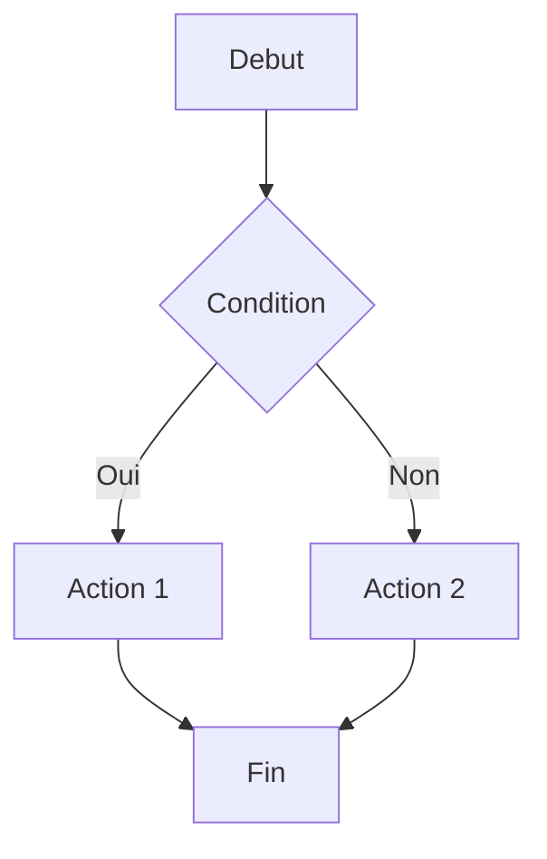

# Documents Numeriques — PDF, Signatures Electroniques, Markdown, LaTeX & Formats

## Overview

Ce document de reference couvre l'ensemble des formats documentaires numeriques et leurs usages professionnels : creation et optimisation de PDF, archivage en PDF/A, signatures electroniques (DocuSign, Yousign, HelloSign, cadre juridique eIDAS), Markdown avance (syntaxe etendue, Pandoc, generateurs de sites statiques), LaTeX pour les documents techniques et scientifiques, comparaison des formats documentaires (DOCX, ODT, PDF, MD, HTML), accessibilite des documents numeriques (WCAG), metadonnees et securite documentaire. Utiliser ce guide pour choisir le format adapte a chaque usage, garantir la conformite juridique des signatures electroniques et optimiser la production de documents numeriques accessibles et securises.

---

## PDF — Creation, Optimisation et Archivage

### Le format PDF : fondamentaux

Le Portable Document Format (PDF), cree par Adobe en 1993 et normalise ISO 32000 depuis 2008, est le format de reference pour la distribution de documents finalises. Ses avantages fondamentaux :

- **Fidelite visuelle** : le document s'affiche de maniere identique sur tous les appareils, systemes d'exploitation et logiciels de lecture.
- **Autonomie** : le fichier PDF embarque les polices, les images et la mise en page — aucune dependance externe.
- **Securite** : possibilite de restreindre l'impression, la copie, la modification et l'ajout d'annotations.
- **Signature electronique** : le PDF est le format standard pour les documents signes electroniquement.
- **Archivage** : le sous-format PDF/A est la norme ISO pour l'archivage a long terme.

### Creation de PDF depuis differentes sources

| Source | Methode | Qualite | Usage |
|---|---|---|---|
| **Microsoft Word** | Fichier > Exporter > PDF | Excellente | Documents professionnels |
| **Google Docs** | Fichier > Telecharger > PDF | Bonne | Documents collaboratifs |
| **LaTeX** | pdflatex ou xelatex | Excellente | Documents scientifiques |
| **Markdown** | Pandoc > PDF (via LaTeX) | Tres bonne | Documentation technique |
| **HTML** | Chrome > Imprimer > PDF | Variable | Pages web, rapports en ligne |
| **Adobe InDesign** | Exporter > PDF | Excellente | Documents de design |
| **Navigateur** | Ctrl+P > Enregistrer en PDF | Variable | Capture rapide |
| **Scanner** | Numerisation + OCR | Variable | Documents papier |

### Optimisation des fichiers PDF

#### Taille du fichier
Les fichiers PDF volumineux posent des problemes de stockage, d'envoi par email et de temps de chargement. Techniques d'optimisation :

- **Compression des images** : les images representent generalement 80-95% de la taille d'un PDF. Reduire la resolution a 150 dpi pour l'affichage ecran, 300 dpi pour l'impression. Utiliser la compression JPEG pour les photos, la compression ZIP/Flate pour les graphiques.
- **Sous-ensembles de polices** : embarquer uniquement les caracteres utilises (sous-ensemble) plutot que la police complete. Passer de 2-5 Mo par police a quelques Ko.
- **Suppression des elements inutiles** : supprimer les metadonnees superflues, les miniatures, les signets inutilises, les couches masquees.
- **Linearisation** : reorganiser le fichier pour un affichage progressif (Fast Web View) — les premieres pages s'affichent avant que le fichier entier soit telecharge.

#### Outils d'optimisation

| Outil | Type | Points forts | Prix |
|---|---|---|---|
| **Adobe Acrobat Pro** | Desktop | Optimisation avancee, audit de taille, profiles | Abonnement (22.99 EUR/mois) |
| **qpdf** | Ligne de commande | Linearisation, decryptage, fusion | Gratuit (open source) |
| **Ghostscript** | Ligne de commande | Compression, conversion, optimisation batch | Gratuit (open source) |
| **pdfcpu** | Ligne de commande (Go) | Validation, optimisation, manipulation | Gratuit (open source) |
| **Smallpdf** | SaaS | Interface simple, compression en ligne | Freemium |
| **iLovePDF** | SaaS | Compression, fusion, conversion | Freemium |

### PDF/A — Archivage a Long Terme

#### Qu'est-ce que PDF/A

PDF/A (ISO 19005) est un sous-ensemble du format PDF concu pour l'archivage a long terme de documents electroniques. Il garantit que le document pourra etre reproduit de maniere identique dans le futur, sans dependance a un logiciel, un systeme d'exploitation ou une technologie specifique.

#### Variantes de PDF/A

| Variante | Norme ISO | Caracteristiques | Usage |
|---|---|---|---|
| **PDF/A-1a** | ISO 19005-1:2005 | Conformite complete (structure logique, Unicode, texte alternatif) | Archivage avec accessibilite |
| **PDF/A-1b** | ISO 19005-1:2005 | Conformite de base (apparence visuelle preservee) | Archivage standard |
| **PDF/A-2a/b/u** | ISO 19005-2:2011 | JPEG2000, transparence, couches, PDF/A imbriques | Archivage avec fonctionnalites etendues |
| **PDF/A-3a/b/u** | ISO 19005-3:2012 | Fichiers joints de tout format (XML, CSV, CAD) | Archivage avec pieces jointes |
| **PDF/A-4** | ISO 19005-4:2020 | Base sur PDF 2.0, simplifie les niveaux de conformite | Archivage moderne |

#### Contraintes de PDF/A
Le format PDF/A impose des restrictions par rapport au PDF standard :
- **Polices** : toutes les polices doivent etre embarquees integralement.
- **Couleurs** : profils ICC obligatoires pour garantir la reproduction des couleurs.
- **Transparence** : interdite en PDF/A-1, autorisee a partir de PDF/A-2.
- **JavaScript** : interdit (pas de scripts exectuables).
- **Formulaires** : les formulaires interactifs XFA sont interdits.
- **Chiffrement** : interdit (le document doit etre accessible sans mot de passe).
- **Multimedia** : audio et video interdits (sauf en PDF/A-3 comme pieces jointes).
- **Liens externes** : les liens vers des ressources externes sont deconseilles.

#### Creation de PDF/A

Dans Microsoft Word :
1. Fichier > Exporter > Creer un document PDF/XPS.
2. Cliquer sur "Options".
3. Cocher "Conforme a la norme ISO 19005-1 (PDF/A)".
4. Cliquer sur "Publier".

Dans Adobe Acrobat Pro :
1. Ouvrir le PDF dans Acrobat Pro.
2. Aller dans Outils > Standards PDF > Enregistrer au format PDF/A.
3. Selectionner la variante souhaitee (PDF/A-1b, PDF/A-2b, etc.).
4. Acrobat convertit le document et signale les elements non conformes.

#### Validation de conformite PDF/A

| Outil | Type | Fonctionnalites | Prix |
|---|---|---|---|
| **veraPDF** | Open source | Validation PDF/A-1 a PDF/A-4, rapports detailles | Gratuit |
| **Adobe Acrobat Pro** | Desktop | Verification Preflight, correction automatique | Abonnement |
| **PDF/A Manager** | Desktop | Validation et conversion batch | Payant |
| **pdfaPilot** | Desktop/Serveur | Validation, conversion, correction automatique | Payant |

---

## Signatures Electroniques

### Cadre Juridique — eIDAS et Reglementation

#### Le reglement eIDAS (Electronic Identification and Trust Services)

Le reglement europeen eIDAS (910/2014), renforce par eIDAS 2.0 (2024), etablit le cadre juridique des signatures electroniques dans l'Union Europeenne. Il definit trois niveaux de signature electronique :

| Niveau | Definition | Valeur juridique | Exemple |
|---|---|---|---|
| **Signature electronique simple (SES)** | Donnees electroniques jointes ou associees logiquement a d'autres donnees electroniques, utilisees comme signature | Recevable en justice, valeur probante faible | Case a cocher "J'accepte", signature manuscrite numerisee, email |
| **Signature electronique avancee (AES/AdES)** | Liee au signataire de maniere univoque, permet de l'identifier, creee avec des donnees sous son controle exclusif, liee aux donnees signees de facon a detecter toute modification | Recevable en justice, valeur probante forte | DocuSign, Yousign, HelloSign (mode standard) |
| **Signature electronique qualifiee (QES)** | Signature avancee creee a l'aide d'un dispositif de creation de signature qualifie (QSCD) et basee sur un certificat qualifie | Equivalence juridique a la signature manuscrite (presomption de fiabilite) | Signature avec certificat qualifie et QSCD (carte a puce, cle USB securisee) |

#### eIDAS 2.0 — Evolutions majeures (2024-2026)

Le reglement eIDAS 2.0, entre en vigueur en 2024, introduit des evolutions significatives :
- **Portefeuille d'identite numerique europeen (EUDI Wallet)** : chaque citoyen europeen pourra disposer d'un portefeuille d'identite numerique reconnu dans tous les Etats membres, permettant la signature electronique qualifiee depuis un smartphone.
- **Reconnaissance mutuelle obligatoire** : les signatures qualifiees delivrees dans un Etat membre doivent etre reconnues dans tous les autres Etats membres sans procedure supplementaire.
- **Archivage electronique qualifie** : nouveau service de confiance pour l'archivage a long terme de documents electroniques avec garantie d'integrite.
- **Registres electroniques qualifies** : nouveau service de confiance pour les registres distribues (blockchain), permettant l'horodatage et la preuve d'existence.

### Solutions de Signature Electronique

#### DocuSign

DocuSign est le leader mondial de la signature electronique avec plus d'un milliard d'utilisateurs :

**Fonctionnalites cles** :
- Signature avancee conforme eIDAS (via partenaires qualifies pour la signature qualifiee).
- Envoi de documents pour signature avec definition des zones de signature, paraphe, date, texte.
- Workflows de signature sequentiels (A signe puis B) ou paralleles (A et B signent independamment).
- Templates de documents avec zones de signature pre-definies.
- Authentification des signataires (email, SMS, piece d'identite, video).
- Piste d'audit complete (certificat d'achevement avec horodatage, adresses IP, actions).
- API REST pour integration dans les applications metier.
- Integrations natives : Salesforce, Microsoft 365, Google Workspace, SAP, ServiceNow.

**Tarifs indicatifs (2025-2026)** :
| Plan | Prix | Fonctionnalites |
|---|---|---|
| Personal | 10 EUR/mois | 5 enveloppes/mois, 1 utilisateur |
| Standard | 25 EUR/utilisateur/mois | Envois illimites, templates, notifications |
| Business Pro | 40 EUR/utilisateur/mois | Formulaires avances, paiement integre, branding |
| Enterprise | Sur devis | API, SSO, administration avancee, compliance |

#### Yousign

Yousign est une solution francaise de signature electronique, conforme eIDAS et hebergee en France/UE :

**Fonctionnalites cles** :
- Signature electronique avancee et qualifiee (Yousign est un prestataire de services de confiance qualifie).
- Interface en francais, support francophone, conformite RGPD native.
- Workflows de signature personnalisables.
- Verification d'identite par piece d'identite et selfie video.
- API REST pour integration (documentation en francais et en anglais).
- Integrations : Salesforce, HubSpot, Zapier, Make.

**Tarifs indicatifs (2025-2026)** :
| Plan | Prix | Fonctionnalites |
|---|---|---|
| One | 9 EUR/mois | 10 signatures/mois, 1 utilisateur |
| Plus | 25 EUR/utilisateur/mois | Signatures illimitees, templates, champs personnalises |
| Pro | 45 EUR/utilisateur/mois | Workflows, approbation, branding avance |
| Enterprise | Sur devis | API, SSO, compliance, support dedie |

#### HelloSign (Dropbox Sign)

HelloSign, renomme Dropbox Sign en 2022, est une solution de signature electronique integree a l'ecosysteme Dropbox :

**Fonctionnalites cles** :
- Signature electronique avancee conforme eIDAS.
- Interface simple et intuitive.
- Integration native avec Dropbox, Google Workspace, HubSpot, Salesforce.
- API pour integration (utilisee par de nombreuses startups et scale-ups).
- Templates avec champs dynamiques.

#### Tableau comparatif des solutions

| Critere | DocuSign | Yousign | HelloSign (Dropbox Sign) |
|---|---|---|---|
| **Origine** | USA | France | USA (Dropbox) |
| **Hebergement** | USA/UE (option) | France/UE | USA/UE (option) |
| **Signature qualifiee** | Via partenaires | Natif (TSP qualifie) | Non |
| **Conformite RGPD** | Oui (DPA) | Natif | Oui (DPA) |
| **API** | Tres complete | Complete | Complete |
| **Ecosysteme** | Le plus large | Croissant | Ecosysteme Dropbox |
| **Support FR** | Oui | Natif | Limite |
| **Prix entree** | 10 EUR/mois | 9 EUR/mois | 12 EUR/mois |

### Implementation d'un Circuit de Signature Electronique

#### Workflow type

```
1. PREPARATION DU DOCUMENT
   ├── Document finalise en PDF (pas de brouillon)
   ├── Zones de signature positionnees
   ├── Champs complementaires definis (date, nom, fonction, paraphe)
   └── Ordre de signature defini (sequentiel ou parallele)

2. ENVOI AUX SIGNATAIRES
   ├── Identification des signataires (email + optionnel : telephone, piece d'identite)
   ├── Message personnalise pour chaque signataire
   ├── Date limite de signature
   └── Rappels automatiques (J+3, J+7)

3. SIGNATURE
   ├── Le signataire recoit une notification (email)
   ├── Il ouvre le document dans le navigateur (pas d'installation requise)
   ├── Il verifie le contenu du document
   ├── Il signe aux emplacements prevus (signature dessinee, tapee ou chargee)
   ├── Authentification supplementaire si requise (code SMS, piece d'identite)
   └── Confirmation de signature

4. COMPLETION
   ├── Tous les signataires ont signe
   ├── Le certificat d'achevement est genere (piste d'audit complete)
   ├── Le document signe est distribue a tous les signataires
   ├── Le document est archive avec ses preuves de signature
   └── Notification aux parties prenantes

5. ARCHIVAGE
   ├── Document signe stocke dans le DMS / SharePoint / Google Drive
   ├── Certificat d'achevement archive avec le document
   ├── Metadonnees renseignees (date, signataires, type de document)
   └── Retention conforme aux obligations legales
```

### Valeur Juridique — Ce qu'il faut savoir

- **Principe de non-discrimination** : un document ne peut etre refuse au seul motif qu'il est sous forme electronique (article 25 eIDAS).
- **Charge de la preuve** : pour la SES et l'AES, c'est a celui qui invoque la signature de prouver sa fiabilite. Pour la QES, la charge de la preuve est inversee (presomption de fiabilite).
- **Droit du travail** : en France, la signature electronique est admise pour les contrats de travail (sauf les CDI et CDD pour lesquels la jurisprudence est encore en construction — verifier l'etat de la jurisprudence au moment de l'utilisation).
- **Droit immobilier** : les actes authentiques (vente immobiliere, hypotheque) necessitent la signature electronique qualifiee d'un officier public (notaire).
- **Droit des societes** : les proces-verbaux d'assemblee, les decisions du conseil d'administration et les actes statutaires peuvent etre signes electroniquement sous certaines conditions.

---

## Markdown Avance

### Syntaxe etendue (Extended Markdown)

Au-dela de la syntaxe de base (CommonMark), plusieurs extensions Markdown sont largement utilisees :

#### Tableaux (GitHub Flavored Markdown)
```markdown
| Colonne 1 | Colonne 2 | Colonne 3 |
|:----------|:---------:|----------:|
| Aligne gauche | Centre | Aligne droite |
| Donnee | Donnee | Donnee |
```

#### Notes de bas de page
```markdown
Voici un texte avec une note[^1].

[^1]: Ceci est le contenu de la note de bas de page.
```

#### Listes de taches
```markdown
- [x] Tache terminee
- [ ] Tache en cours
- [ ] Tache a faire
```

#### Blocs de code avec coloration syntaxique
````markdown
```python
def hello():
    print("Bonjour le monde")
```
````

#### Blocs d'avertissement (admonitions)
```markdown
> [!NOTE]
> Information complementaire importante.

> [!WARNING]
> Attention : cette operation est irreversible.

> [!TIP]
> Conseil : utiliser les raccourcis clavier pour gagner du temps.
```

#### Diagrammes (Mermaid)
````markdown

````

### Pandoc — Le couteau suisse de la conversion documentaire

Pandoc est l'outil de reference pour convertir des documents entre des dizaines de formats. Il est particulierement puissant pour transformer du Markdown en documents professionnels :

#### Conversions courantes

```bash
# Markdown vers Word (avec template)
pandoc document.md -o document.docx --reference-doc=template.docx

# Markdown vers PDF (via LaTeX)
pandoc document.md -o document.pdf --pdf-engine=xelatex

# Markdown vers HTML
pandoc document.md -o document.html --standalone --css=style.css

# Markdown vers presentation (reveal.js)
pandoc slides.md -o presentation.html -t revealjs --slide-level=2

# Word vers Markdown
pandoc document.docx -o document.md --wrap=none --extract-media=images

# HTML vers Markdown
pandoc page.html -o document.md

# LaTeX vers Word
pandoc article.tex -o article.docx
```

#### Variables et metadonnees Pandoc

Les metadonnees peuvent etre definies dans le frontmatter YAML du document Markdown :

```yaml
---
title: "Rapport trimestriel Q1 2026"
author:
  - "Jean Dupont"
  - "Marie Martin"
date: "16 fevrier 2026"
lang: fr
abstract: "Ce rapport presente les resultats du premier trimestre 2026."
toc: true
toc-depth: 3
numbersections: true
geometry: "margin=2.5cm"
fontsize: 11pt
mainfont: "Arial"
---
```

#### Filtres Pandoc (Lua et Python)

Pandoc supporte des filtres qui transforment le document pendant la conversion. Les filtres Lua sont les plus performants :

```lua
-- Filtre Lua : convertir tous les titres de niveau 1 en majuscules
function Header(el)
  if el.level == 1 then
    return pandoc.walk_block(el, {
      Str = function(s)
        return pandoc.Str(pandoc.text.upper(s.text))
      end
    })
  end
end
```

### Markdown pour la documentation d'entreprise

#### Generateurs de sites statiques

Les generateurs de sites statiques transforment des fichiers Markdown en sites web professionnels :

| Generateur | Langage | Usage typique | Points forts |
|---|---|---|---|
| **MkDocs** | Python | Documentation technique | Simple, themes professionnels (Material) |
| **Hugo** | Go | Sites et documentation | Tres rapide, flexible |
| **Docusaurus** | React | Documentation de produit | Versioning, recherche, i18n |
| **Sphinx** | Python | Documentation Python/technique | Autodoc, references croisees |
| **GitBook** | Node.js/SaaS | Documentation et wikis | Interface intuitive, collaboration |
| **VitePress** | Vue.js | Documentation technique | Rapide, moderne, Vue.js natif |

---

## LaTeX — Documents Scientifiques et Techniques

### Quand utiliser LaTeX

LaTeX est le systeme de composition de documents de reference pour les publications scientifiques, academiques et techniques. Utiliser LaTeX quand :

- Le document contient de nombreuses **equations mathematiques** complexes.
- La **qualite typographique** est critique (publications, theses, livres).
- Le document est **long et structure** (these, rapport technique, livre).
- La **gestion bibliographique** est intensive (centaines de references).
- Le document necessite des **references croisees** fiables (figures, tableaux, equations, sections).
- La **reproductibilite** est requise (le meme source produit toujours le meme resultat).

### Structure d'un document LaTeX

```latex
\documentclass[12pt,a4paper,french]{report}

% Packages essentiels
\usepackage[utf8]{inputenc}
\usepackage[T1]{fontenc}
\usepackage{babel}
\usepackage{amsmath,amssymb}
\usepackage{graphicx}
\usepackage{hyperref}
\usepackage{geometry}
\usepackage{listings}
\usepackage{booktabs}
\usepackage[backend=biber,style=apa]{biblatex}

% Configuration
\geometry{margin=2.5cm}
\addbibresource{references.bib}

% Metadonnees
\title{Rapport Technique}
\author{Jean Dupont}
\date{\today}

\begin{document}

\maketitle
\tableofcontents

\chapter{Introduction}
Ce chapitre presente le contexte et les objectifs.

\section{Contexte}
Le contexte du projet est le suivant...

\section{Objectifs}
Les objectifs de ce rapport sont :
\begin{enumerate}
    \item Analyser les donnees collectees
    \item Proposer des recommandations
    \item Evaluer les risques
\end{enumerate}

\chapter{Methodologie}

L'equation fondamentale est :
\begin{equation}
    E = mc^2 \label{eq:einstein}
\end{equation}

Comme le montre l'equation~\ref{eq:einstein}, l'energie est proportionnelle a la masse.

\printbibliography

\end{document}
```

### Avantages de LaTeX pour les documents professionnels

| Aspect | LaTeX | Word |
|---|---|---|
| **Equations** | Natif, qualite parfaite | Editeur d'equations limite |
| **Typographie** | Professionnelle par defaut | Depend de la configuration |
| **Grandes bibliographies** | BibTeX/Biber, gestion native | Gestionnaire limite, outils externes |
| **Documents longs (500+ pages)** | Stable et performant | Risque d'instabilite |
| **Versionnage** | Git-friendly (fichiers texte) | Binaire, versionnage difficile |
| **Courbe d'apprentissage** | Elevee (syntaxe a apprendre) | Faible (interface graphique) |
| **Collaboration temps reel** | Overleaf | Word Online, Google Docs |
| **Templates entreprise** | Complexe a creer | Facile a creer |

---

## Comparaison des Formats Documentaires

### Tableau comparatif des formats

| Critere | DOCX | ODT | PDF | MD | HTML | LaTeX |
|---|---|---|---|---|---|---|
| **Editabilite** | Excellente | Bonne | Limitee | Excellente | Bonne | Excellente |
| **Mise en forme** | Riche | Riche | Fidelite | Limitee | Riche (CSS) | Tres riche |
| **Collaboration** | Word Online | Limitee | Annotation | Git | Possible | Overleaf |
| **Accessibilite** | Bonne | Moyenne | Bonne (si balisee) | Bonne | Excellente (natif) | Moyenne |
| **Archivage** | Moyen | Bon (ISO) | Excellent (PDF/A) | Excellent | Moyen | Excellent |
| **Taille fichier** | Moyenne | Moyenne | Variable | Tres petite | Petite | Petite (source) |
| **Interoperabilite** | Microsoft | LibreOffice | Universel | Universel | Universel | Communaute |
| **Signature electronique** | Non | Non | Oui (natif) | Non | Non | Non |
| **Impression** | Bonne | Bonne | Excellente | Via conversion | Via CSS print | Excellente |
| **Multi-plateforme** | Windows/Mac/Web | Toutes | Toutes | Toutes | Toutes | Toutes |

### Choix du format selon le cas d'usage

| Cas d'usage | Format recommande | Raison |
|---|---|---|
| **Rapport interne collaboratif** | DOCX ou Google Docs | Co-edition, Track Changes, styles |
| **Contrat a signer** | PDF | Signature electronique, non modifiable |
| **Documentation technique** | Markdown (+ generateur de site) | Git-friendly, conversion multi-format |
| **Publication scientifique** | LaTeX | Equations, bibliographie, qualite typo |
| **Archivage long terme** | PDF/A | Norme ISO, autonome, perenne |
| **Page web / intranet** | HTML | Natif web, accessible, responsive |
| **Echange inter-organisations** | PDF | Fidelite visuelle, universel |
| **Template modifiable** | DOCX (template .dotx) | Styles, Quick Parts, macros |
| **Livre / these** | LaTeX ou DOCX (Word long) | Structure, index, bibliographie |
| **Email marketing** | HTML (+ texte brut) | Rendu visuel dans les clients email |

### ODT — Le Format Open Document

Le format ODT (Open Document Text, ISO/IEC 26300) est le format natif de LibreOffice Writer et un standard ouvert :

- **Avantages** : format ouvert et normalise (ISO), pas de dependance a un editeur logiciel, perennite garantie par la standardisation.
- **Limites** : compatibilite imparfaite avec Microsoft Word (styles, champs, macros non compatibles), adoption limitee en entreprise, ecosysteme d'outils moins developpe.
- **Usage recommande** : administrations publiques (souvent imposee par les politiques d'achat), organisations privilegiant les standards ouverts, documents destines a l'archivage en format ouvert.

---

## Accessibilite des Documents Numeriques (WCAG)

### Pourquoi l'accessibilite documentaire

L'accessibilite documentaire garantit que les documents numeriques sont utilisables par les personnes en situation de handicap (visuel, auditif, moteur, cognitif). Au-dela de l'obligation ethique, l'accessibilite est une exigence legale :

- **France** : la loi pour une Republique numerique (2016) et le RGAA (Referentiel General d'Amelioration de l'Accessibilite) imposent l'accessibilite des documents publics.
- **Europe** : la directive europeenne sur l'accessibilite (European Accessibility Act, 2025) etend les obligations au secteur prive.
- **USA** : l'ADA (Americans with Disabilities Act) et la Section 508 imposent l'accessibilite des documents gouvernementaux.

### Regles d'accessibilite pour les documents

#### Structure et navigation
- **Titres hierarchiques** : utiliser les styles de titres (H1-H6) pour structurer le document. Les lecteurs d'ecran utilisent les titres pour naviguer dans le document.
- **Table des matieres** : inclure une table des matieres generee automatiquement a partir des titres. Elle sert de navigation principale pour les utilisateurs de technologies d'assistance.
- **Ordre de lecture logique** : l'ordre de lecture du document doit suivre un flux logique. Eviter les zones de texte flottantes, les colonnes complexes et les mises en page non lineaires.
- **Signets** : dans les PDF, creer des signets (bookmarks) pour chaque titre et sous-titre, permettant la navigation dans le panneau de signets.

#### Texte et typographie
- **Polices lisibles** : utiliser des polices sans-serif (Arial, Calibri, Verdana) avec une taille minimale de 11pt pour le corps de texte.
- **Contraste** : garantir un ratio de contraste d'au moins 4.5:1 pour le texte normal et 3:1 pour le texte de grande taille (18pt ou 14pt gras). Utiliser un verificateur de contraste (WebAIM Contrast Checker).
- **Pas de couleur seule** : ne jamais utiliser la couleur comme seul moyen de transmettre une information. Completer avec du texte, un symbole ou un motif.
- **Espacement** : interligne d'au moins 1.5, espacement entre paragraphes d'au moins 1.5 fois l'espacement des lignes.

#### Images et medias
- **Texte alternatif** : chaque image doit avoir un texte alternatif decrivant son contenu et sa fonction. Pour les images decoratives, utiliser un texte alternatif vide ("").
- **Descriptions longues** : pour les graphiques complexes et les infographies, fournir une description longue en texte dans le document (pas seulement un texte alternatif court).
- **Sous-titres** : les contenus audio et video integres doivent avoir des sous-titres ou une transcription textuelle.

#### Tableaux
- **En-tetes de colonnes et de lignes** : definir les cellules d'en-tete de maniere explicite pour que les lecteurs d'ecran puissent associer chaque cellule de donnees a ses en-tetes.
- **Eviter les cellules fusionnees** : les cellules fusionnees complexifient la navigation au lecteur d'ecran. Preferer des tableaux simples.
- **Repetition des en-tetes** : pour les tableaux qui s'etendent sur plusieurs pages, repeter la ligne d'en-tete sur chaque page.

#### Liens
- **Texte de lien descriptif** : utiliser un texte de lien qui decrit la destination ("Consulter le rapport annuel 2025") plutot que l'URL brute ou "cliquez ici".
- **Distinction visuelle** : les liens doivent etre visuellement distincts du texte environnant (souligne + couleur).

### Verification de l'accessibilite

| Outil | Documents | Fonctionnalites |
|---|---|---|
| **Verificateur d'accessibilite Word** | DOCX | Verification automatique, suggestions de correction |
| **Verificateur Google Docs** | Google Docs | Verification de base (texte alt, titres) |
| **Adobe Acrobat Pro** | PDF | Verification PDF/UA, correction des balises |
| **PAC (PDF Accessibility Checker)** | PDF | Verification gratuite de la conformite PDF/UA |
| **axe DevTools** | HTML | Verification WCAG pour les documents HTML |
| **NVDA** | Tous | Lecteur d'ecran gratuit pour tester l'accessibilite reelle |
| **VoiceOver** | Tous (Mac/iOS) | Lecteur d'ecran Apple pour tester l'accessibilite |

### PDF/UA — Accessibilite Universelle pour les PDF

Le format PDF/UA (ISO 14289) definit les exigences d'accessibilite pour les documents PDF :
- **Balisage semantique** : chaque element du document (titre, paragraphe, image, tableau) doit avoir une balise semantique dans l'arbre de structure du PDF.
- **Ordre de lecture** : l'ordre de lecture dans l'arbre de structure doit correspondre a l'ordre logique du contenu.
- **Texte alternatif** : tous les elements non textuels doivent avoir un texte alternatif.
- **Polices Unicode** : toutes les polices doivent etre encodees en Unicode pour permettre l'extraction de texte.

---

## Metadonnees et Securite Documentaire

### Metadonnees des documents

Les metadonnees sont des informations structurees decrivant le document : auteur, titre, date de creation, mots-cles, classification. Elles servent a :
- **Recherche** : retrouver un document par ses proprietes (auteur, date, mots-cles) sans ouvrir le fichier.
- **Classification** : organiser les documents par type, departement, projet, niveau de confidentialite.
- **Gouvernance** : appliquer des politiques de retention, d'archivage et de destruction basees sur les metadonnees.
- **Conformite** : satisfaire les exigences reglementaires de tracabilite et d'archivage.

#### Types de metadonnees

| Type | Exemples | Source |
|---|---|---|
| **Descriptives** | Titre, auteur, resume, mots-cles | Saisie manuelle ou automatique |
| **Administratives** | Date de creation, date de modification, version, format | Generees par le systeme |
| **Techniques** | Taille du fichier, resolution, polices embarquees | Generees par le logiciel |
| **Juridiques** | Classification, retention, droits d'acces, copyright | Definies par la politique |
| **Structurelles** | Table des matieres, chapitres, relations entre documents | Derivees de la structure |

#### Nettoyage des metadonnees avant distribution

Avant de distribuer un document a l'externe, verifier et nettoyer les metadonnees sensibles :

**Dans Microsoft Word** :
1. Fichier > Verifier la presence de problemes > Inspecter le document.
2. L'inspecteur detecte : commentaires, marques de revision, proprietes personnelles, donnees XML, en-tetes/pieds de page masques, texte masque.
3. Selectionner les categories a supprimer et cliquer sur "Supprimer tout".

**Dans Adobe Acrobat** :
1. Outils > Caviarder > Supprimer les informations masquees.
2. Acrobat detecte et supprime : metadonnees, fichiers joints, signets, commentaires, texte masque, couches masquees.

### Securite des documents PDF

#### Niveaux de protection

| Protection | Description | Contournement |
|---|---|---|
| **Mot de passe d'ouverture** | Le document ne peut pas etre ouvert sans le mot de passe | Fort (chiffrement AES-256) |
| **Mot de passe de permissions** | Restreint les actions (impression, copie, modification) | Faible (facilement contournable avec des outils) |
| **Signature numerique** | Garantit l'integrite et l'authenticite du document | Ne peut pas etre contrefaite |
| **Chiffrement** | Le contenu est chiffre avec AES-128 ou AES-256 | Fort si le mot de passe est robuste |
| **DRM (Digital Rights Management)** | Controle granulaire des droits (ouverture, impression, copie, duree) | Fort (necessite un serveur de licences) |
| **Caviardage** | Suppression irreversible de contenu sensible | Irreversible si correctement applique |

#### Bonnes pratiques de securite documentaire

- **Classifier les documents** : definir des niveaux de classification (Public, Interne, Confidentiel, Secret) et appliquer les protections correspondantes.
- **Chiffrer les documents sensibles** : utiliser un chiffrement AES-256 pour les documents confidentiels. Ne jamais envoyer le mot de passe par le meme canal que le document.
- **Caviarder correctement** : ne jamais utiliser de rectangles noirs par-dessus du texte (le texte reste accessible dans les metadonnees). Utiliser l'outil de caviardage d'Acrobat Pro ou un outil dedie qui supprime definitivement le contenu.
- **Signer numeriquement** : utiliser la signature numerique (certificat X.509) pour les documents critiques afin de garantir qu'ils n'ont pas ete modifies apres la signature.
- **Auditer les acces** : dans les systemes de gestion documentaire (SharePoint, M-Files), activer l'audit des acces pour savoir qui a ouvert, modifie, telecharge ou partage chaque document.
- **Politique de retention** : definir des durees de retention par type de document et automatiser la destruction ou l'archivage a l'echeance.

---

## Tendances 2025-2026

### Document Intelligence et IA

- **Azure AI Document Intelligence** (anciennement Form Recognizer) : extraction automatique de donnees structurees a partir de documents non structures (factures, contrats, formulaires, pieces d'identite). Modeles pre-entraines et personnalisables.
- **Google Document AI** : suite d'outils d'extraction et de classification de documents. Modeles specialises (factures, recus, contrats, prets).
- **Amazon Textract** : extraction de texte, tableaux et formulaires a partir de documents scannes et de PDF.
- **IA generative pour les documents** : Copilot (Microsoft) et Gemini (Google) integrent des capacites de generation, synthese et reformulation directement dans les outils de traitement de texte.

### Formats emergents

- **EPUB 3** : pour les publications numeriques (manuels, rapports interactifs), EPUB 3 offre un format ouvert, accessible et adaptable (responsive).
- **Jupyter Notebooks** : pour les rapports analytiques combinant texte, code et visualisations, les notebooks Jupyter deviennent un format de document a part entiere dans les equipes data.
- **PDF 2.0** (ISO 32000-2:2020) : la derniere version du standard PDF apporte des fonctionnalites avancees (annotations etendues, objets 3D, accessibilite amelioree, chiffrement AES-256 natif).

### Zero-trust et documents

L'approche zero-trust s'etend aux documents :
- **Information Rights Management (IRM)** : les documents sont chiffres et proteges par des droits persistants qui suivent le document ou qu'il aille (Microsoft Purview Information Protection, Adobe Experience Manager).
- **Data Loss Prevention (DLP)** : les systemes DLP detectent et bloquent l'envoi de documents sensibles vers des destinations non autorisees (email externe, stockage cloud personnel, peripheriques USB).
- **Classification automatique** : l'IA classifie automatiquement les documents en fonction de leur contenu (detection de donnees personnelles, de secrets commerciaux, de propriete intellectuelle) et applique les protections correspondantes.
